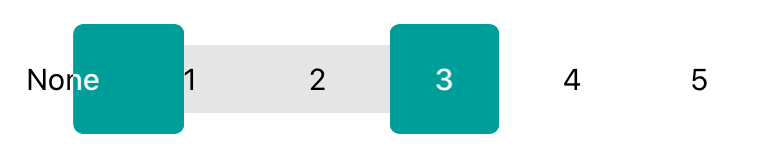

# SlidingRangeSelector


Simple, nice range selector with the behaviour of a slider, that allows to select a range of values

## Main Features
* select range by taping on values or by sliding thumbs
* thumbs that can change their width interactively while sliding
* masked labels, that gives nice effect while sliding a thumb


## Installation

Just add ```SlidingRangeSelector.swift``` file to your Xcode project

## Usage

You can find example of usage in an `Example` project. It's really easy to setup Slider.

```Swift
sliderView.set(
    values: ["uptech", "1", "2", "3", "4"],
    minSelectedValueIndex: 0,
    maxSelectedValueIndex: 3,
    animated: false
)
```

## Contributing
Pull requests are welcome. For major changes, please open an issue first to discuss what you would like to change.

## License
[MIT](./LICENSE.MD)
